# Fcitx5 macOS 主题合集 · Glow + Guest

**85 套主题，170 组深浅配色。** 分为两套设计语言，可独立安装、互不冲突：

| 系列 | 数量 | 布局 | 设计语言 | CSS 变量前缀 |
|---|---|---|---|---|
| **Glow Collection**（本仓库原创） | 14 | 横排 | 选中候选发光、呼吸/流光动效 | `--gs-*` |
| **Guest Collection**（第三方导入） | 71 | 竖排 | 低对比度静态背景、隐藏翻页按钮 | `--dp-*` |

两者都只使用本地 CSS，无远程素材、字体下载或 JavaScript 插件。CSS 只改变绘制，不改变候选窗几何与滚动行为。

## 效果预览

**Glow · 深色模式**

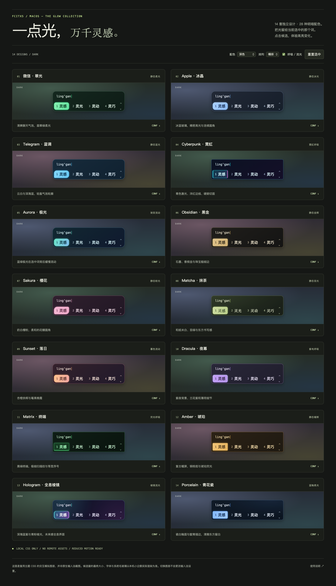

**Glow · 浅色模式**

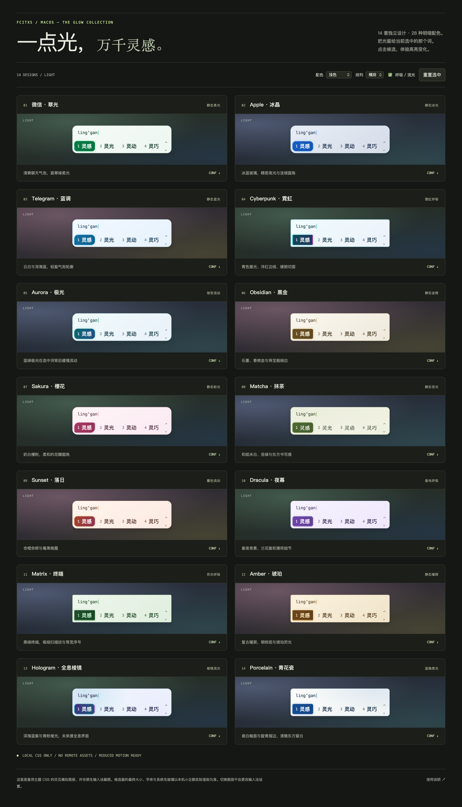

> 以上为复用主题 CSS 的模拟预览，不是原生输入法截图。双击打开 [交互图册](glow-studio/preview.html) 可切换深浅、横竖排，点击候选体验选中高亮（仅覆盖 Glow 系列）。

## 安装

```sh
# 全部（Glow + Guest，共 85 套）
cp Glow-*.conf Guest-*.conf ~/.local/share/fcitx5/theme/
cp glow-studio/css/*.css    ~/.local/share/fcitx5/www/css/

# 只装 Guest 系列
cp Guest-*.conf          ~/.local/share/fcitx5/theme/
cp glow-studio/css/guest-*.css ~/.local/share/fcitx5/www/css/
```

安装后在 **主题编辑器 → 基础 → 选择/导入主题** 中选择对应 `.conf`，并确认 **高级 → 用户 CSS** 已指向同名 `glow-*.css` / `guest-*.css`。

> CSS 都在 `glow-studio/css/`。`fcitx:///file/css/` 指向的就是 `~/.local/share/fcitx5/www/css/`，所以两个目录里必须都有同名文件。

## Glow Collection · 14 套

默认横排；为当前选中的候选提供光晕。

| 主题 | 风格 | 选中效果 |
|---|---|---|
| Glow-WeChat | 微信 · 翠光，日常清爽 | 静态翡翠柔光 |
| Glow-Apple | Apple · 冰晶，冰蓝玻璃质感 | 静态冰光＋细高光 |
| Glow-Telegram | Telegram · 蓝调，气泡轮廓 | 静态天蓝光晕 |
| Glow-Cyberpunk | Cyberpunk · 霓虹，青色/洋红双边 | 3.8s 霓虹呼吸 |
| Glow-Aurora | Aurora · 极光，蓝绿渐变 | 7s 背景流光 |
| Glow-Obsidian | Obsidian · 黑金，香槟细边 | 静态金辉 |
| Glow-Sakura | Sakura · 樱花，花瓣圆角 | 静态樱粉柔光 |
| Glow-Matcha | Matcha · 抹茶，和纸底、宋体字 | 静态苔绿微光 |
| Glow-Sunset | Sunset · 落日，杏橙莓果 | 7s 暮色流光 |
| Glow-Dracula | Dracula · 夜幕，紫夜薄荷边 | 3.8s 紫电呼吸 |
| Glow-Matrix | Matrix · 终端，扫描细纹 | 3.8s 荧光呼吸 |
| Glow-Amber | Amber · 琥珀，复古暖屏 | 静态琥珀光晕 |
| Glow-Hologram | Hologram · 全息棱镜，深海青紫 | 7s 青紫粉棱镜流光 |
| Glow-Porcelain | Porcelain · 青花瓷，瓷白靛青 | 静态蓝釉柔光 |

## Guest Collection · 71 套

第三方主题合集，已按本仓库格式导入：文件平铺到根目录并加 `Guest-` 前缀，CSS 放入 `glow-studio/css/`，`UserCss` 路径同步重写。

**统一规格：** 纵排候选 · 隐藏翻页按钮 · 15px 常规字重 · 紧凑间距 · 较小高亮圆角（10/5）· 光标标记 `●`（竖条）· 每套均有配套低对比度静态背景 · 同时适配亮色与暗色。

> 主题均为静态低对比度背景，不含 Glow 系列的发光与动效。原始文件保存在 `fcitx5-custom-theme-collection/`，`glow-studio/import-guest.py` 可重新导入。

**全部 71 套一览（深色）**

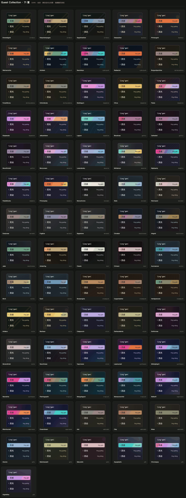

**全部 71 套一览（浅色）**

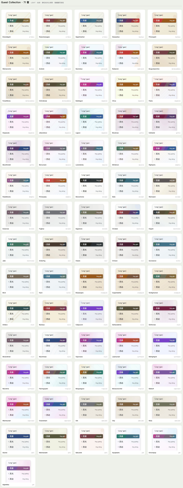

> 以上为复用主题 CSS 的模拟预览，不是原生输入法截图；下方按风格家族分组展示。

**装饰艺术** · 3 套

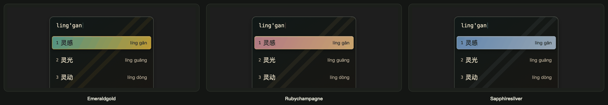

| 主题 | 风格 |
|---|---|
| `Guest-ArtDeco-EmeraldGold` | 装饰艺术·祖母绿金 |
| `Guest-ArtDeco-RubyChampagne` | 装饰艺术·红宝石香槟 |
| `Guest-ArtDeco-SapphireSilver` | 装饰艺术·蓝宝石银 |

**包豪斯** · 3 套

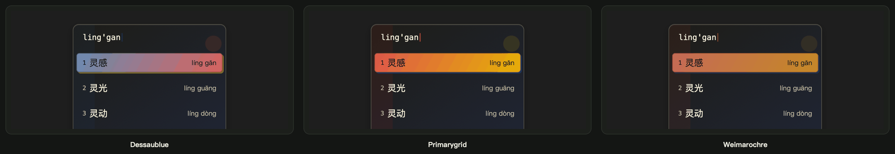

| 主题 | 风格 |
|---|---|
| `Guest-Bauhaus-DessauBlue` | 包豪斯·德绍蓝 |
| `Guest-Bauhaus-PrimaryGrid` | 包豪斯·原色网格 |
| `Guest-Bauhaus-WeimarOchre` | 包豪斯·魏玛赭黄 |

**赛博朋克** · 3 套

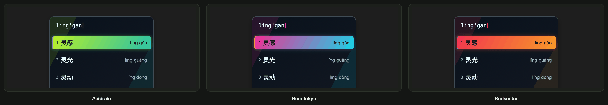

| 主题 | 风格 |
|---|---|
| `Guest-Cyberpunk-AcidRain` | 赛博朋克·酸雨 |
| `Guest-Cyberpunk-NeonTokyo` | 赛博朋克·霓虹东京 |
| `Guest-Cyberpunk-RedSector` | 赛博朋克·红色扇区 |

**暗黑学院** · 3 套

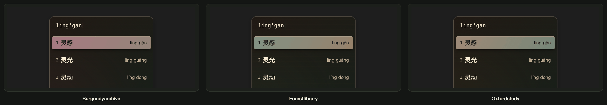

| 主题 | 风格 |
|---|---|
| `Guest-DarkAcademia-BurgundyArchive` | 暗黑学院·勃艮第档案 |
| `Guest-DarkAcademia-ForestLibrary` | 暗黑学院·森林图书馆 |
| `Guest-DarkAcademia-OxfordStudy` | 暗黑学院·牛津书房 |

**多巴胺** · 6 套

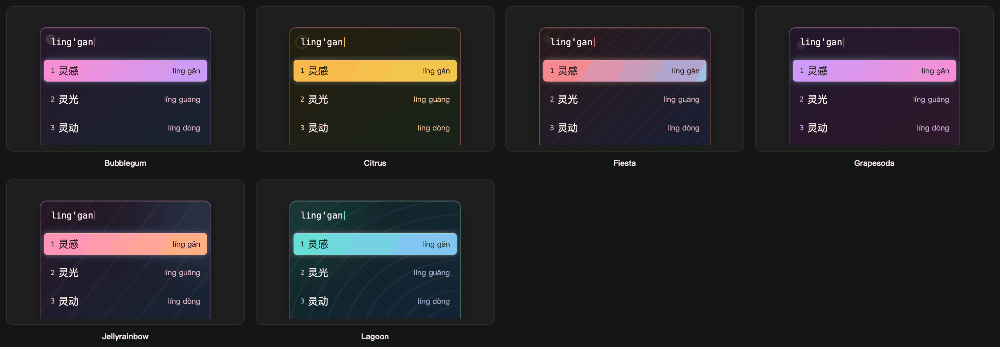

| 主题 | 风格 |
|---|---|
| `Guest-Dopamine-Bubblegum` | 糖果泡泡 — 草莓粉、葡萄紫与苏打蓝，柔软圆润的糖果感 |
| `Guest-Dopamine-Citrus` | 柑橘汽水 — 橙子、柠檬与青柠，明亮清脆的气泡感 |
| `Guest-Dopamine-Fiesta` | 节庆撞色 — 珊瑚红、皇家蓝与金黄，利落热烈的海报撞色 |
| `Guest-Dopamine-GrapeSoda` | 葡萄苏打 — 葡萄紫、莓果粉与荧光青，甜酷浓郁的汽水色 |
| `Guest-Dopamine-JellyRainbow` | 彩虹果冻 — 莓红、橙黄、蓝紫与薄荷青，透明果冻般的彩虹流光 |
| `Guest-Dopamine-Lagoon` | 热带泻湖 — 海岛青、深海蓝与珊瑚橙，清凉又活泼 |

**哥特式** · 3 套

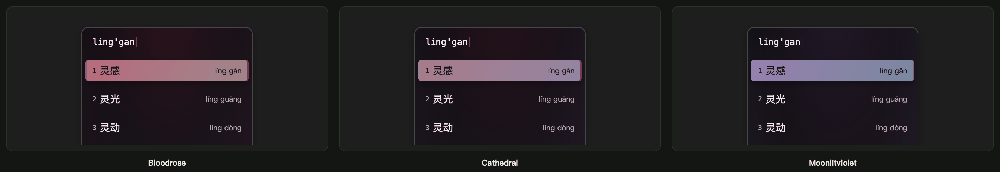

| 主题 | 风格 |
|---|---|
| `Guest-Gothic-BloodRose` | 哥特式·血色玫瑰 |
| `Guest-Gothic-Cathedral` | 哥特式·暗夜教堂 |
| `Guest-Gothic-MoonlitViolet` | 哥特式·月光紫罗兰 |

**马卡龙** · 3 套

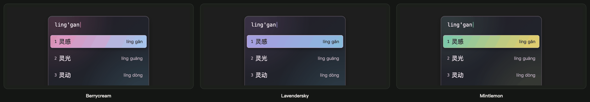

| 主题 | 风格 |
|---|---|
| `Guest-Macaron-BerryCream` | 马卡龙·莓果奶油 |
| `Guest-Macaron-LavenderSky` | 马卡龙·薰衣草天空 |
| `Guest-Macaron-MintLemon` | 马卡龙·薄荷柠檬 |

**孟菲斯** · 3 套

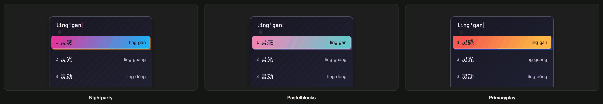

| 主题 | 风格 |
|---|---|
| `Guest-Memphis-NightParty` | 孟菲斯·夜间派对 |
| `Guest-Memphis-PastelBlocks` | 孟菲斯·粉彩积木 |
| `Guest-Memphis-PrimaryPlay` | 孟菲斯·原色游戏 |

**极简主义** · 3 套

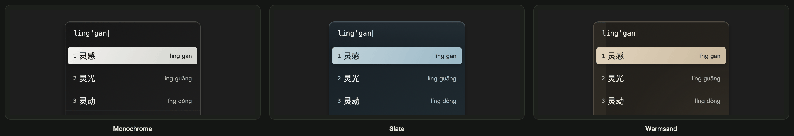

| 主题 | 风格 |
|---|---|
| `Guest-Minimal-Monochrome` | 极简·黑白 — 纯粹黑白、克制细线和清晰层级 |
| `Guest-Minimal-Slate` | 极简·冷灰蓝 — 石板灰与雾蓝，冷静清晰的现代界面 |
| `Guest-Minimal-WarmSand` | 极简·暖砂 — 砂岩、亚麻与炭灰组成的温暖中性色 |

**莫兰迪** · 3 套

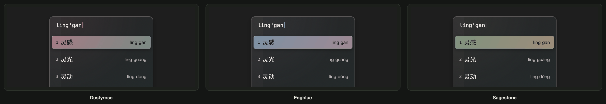

| 主题 | 风格 |
|---|---|
| `Guest-Morandi-DustyRose` | 莫兰迪·灰粉玫瑰 |
| `Guest-Morandi-FogBlue` | 莫兰迪·雾霾蓝 |
| `Guest-Morandi-SageStone` | 莫兰迪·鼠尾草石 |

**新中式** · 3 套

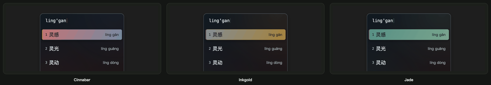

| 主题 | 风格 |
|---|---|
| `Guest-NeoChinese-Cinnabar` | 新中式·朱砂黛青 |
| `Guest-NeoChinese-InkGold` | 新中式·墨金 |
| `Guest-NeoChinese-Jade` | 新中式·玉石青绿 |

**黑色电影** · 3 套

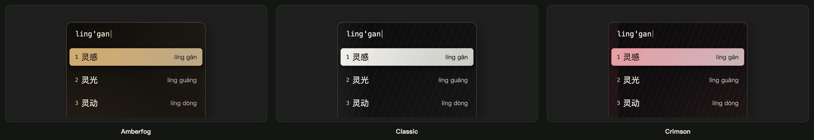

| 主题 | 风格 |
|---|---|
| `Guest-Noir-AmberFog` | 黑色电影·琥珀迷雾 — 旧胶片棕、路灯琥珀与浓重黑影 |
| `Guest-Noir-Classic` | 黑色电影·经典 — 银幕黑白、高反差与硬朗阴影 |
| `Guest-Noir-Crimson` | 黑色电影·猩红 — 煤黑、烟灰与一抹猩红，悬疑而危险 |

**北欧** · 3 套

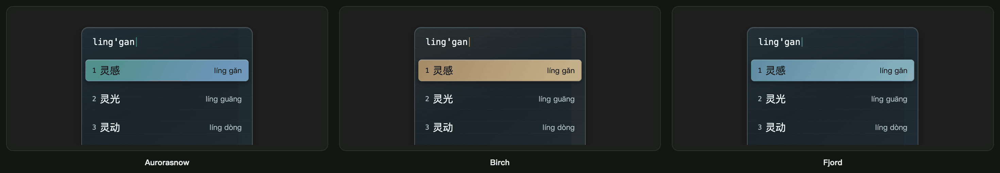

| 主题 | 风格 |
|---|---|
| `Guest-Nordic-AuroraSnow` | 北欧·极光雪原 |
| `Guest-Nordic-Birch` | 北欧·白桦 |
| `Guest-Nordic-Fjord` | 北欧·峡湾 |

**蒸汽朋克** · 3 套

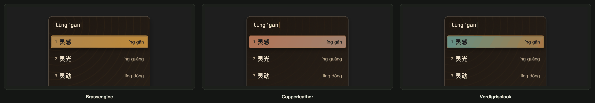

| 主题 | 风格 |
|---|---|
| `Guest-Steampunk-BrassEngine` | 蒸汽朋克·黄铜引擎 |
| `Guest-Steampunk-CopperLeather` | 蒸汽朋克·红铜皮革 |
| `Guest-Steampunk-VerdigrisClock` | 蒸汽朋克·铜绿钟表 |

**综合作风** · 8 套

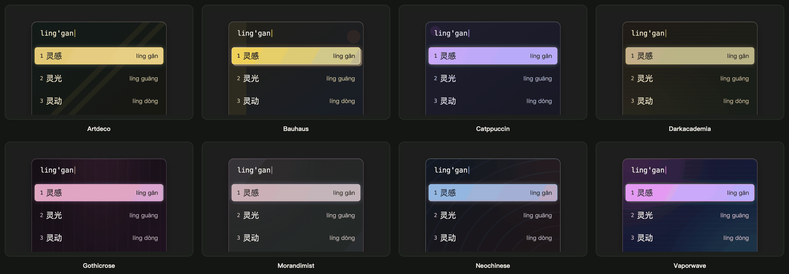

| 主题 | 风格 |
|---|---|
| `Guest-Style-ArtDeco` | 装饰艺术 — 祖母绿、香槟金与黑，克制的奢华秩序 |
| `Guest-Style-Bauhaus` | 包豪斯原色 — 红黄蓝、黑与暖白，几何而理性 |
| `Guest-Style-Catppuccin` | Catppuccin — 柔和的拿铁与摩卡配色，现代而舒适 |
| `Guest-Style-DarkAcademia` | 暗黑学院 — 胡桃木、墨绿与旧纸黄，沉静的古典书房感 |
| `Guest-Style-GothicRose` | 哥特玫瑰 — 黑玫瑰、酒红与暗紫，冷峻而戏剧化 |
| `Guest-Style-MorandiMist` | 莫兰迪雾色 — 灰粉、鼠尾草与雾蓝，低饱和而安静 |
| `Guest-Style-NeoChinese` | 新中式青瓷 — 瓷白、黛青与朱砂，雅致的东方留白 |
| `Guest-Style-Vaporwave` | 蒸汽波霓虹 — 霓虹粉紫与冰蓝，梦幻的互联网复古感 |

**合成波** · 3 套

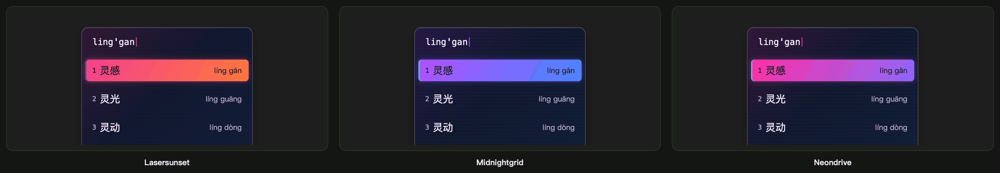

| 主题 | 风格 |
|---|---|
| `Guest-Synthwave-LaserSunset` | 合成波·激光落日 |
| `Guest-Synthwave-MidnightGrid` | 合成波·午夜网格 |
| `Guest-Synthwave-NeonDrive` | 合成波·霓虹夜驾 |

**热带主义** · 3 套

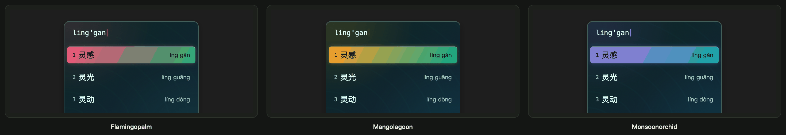

| 主题 | 风格 |
|---|---|
| `Guest-Tropical-FlamingoPalm` | 热带主义·火烈鸟棕榈 |
| `Guest-Tropical-MangoLagoon` | 热带主义·芒果泻湖 |
| `Guest-Tropical-MonsoonOrchid` | 热带主义·季风兰花 |

**蒸汽波** · 3 套

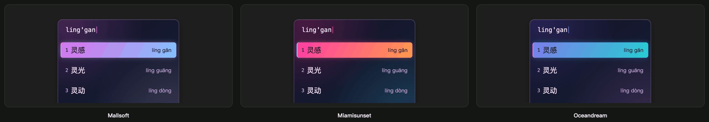

| 主题 | 风格 |
|---|---|
| `Guest-Vaporwave-Mallsoft` | 蒸汽波·梦核商场 |
| `Guest-Vaporwave-MiamiSunset` | 蒸汽波·迈阿密落日 |
| `Guest-Vaporwave-OceanDream` | 蒸汽波·海洋梦境 |

**侘寂** · 3 套

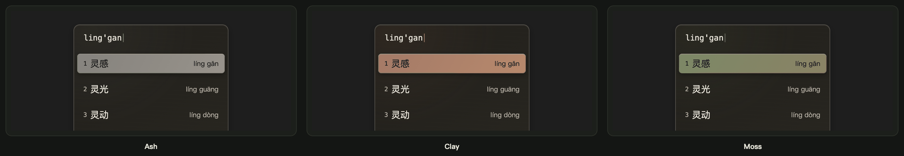

| 主题 | 风格 |
|---|---|
| `Guest-WabiSabi-Ash` | 侘寂·灰烬 |
| `Guest-WabiSabi-Clay` | 侘寂·陶土 |
| `Guest-WabiSabi-Moss` | 侘寂·苔痕 |

**和风** · 3 套

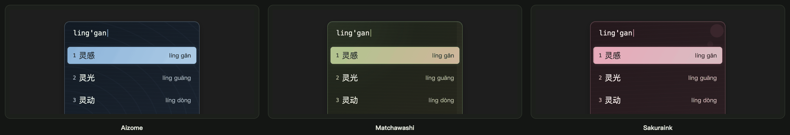

| 主题 | 风格 |
|---|---|
| `Guest-Wafu-Aizome` | 和风·藍染 — 藍染深青、月白与浅墨，沉稳清澈 |
| `Guest-Wafu-MatchaWashi` | 和风·抹茶和纸 — 抹茶绿、和纸米白与茶褐，朴素自然 |
| `Guest-Wafu-SakuraInk` | 和风·樱墨 — 樱粉、墨黑与朱印红，柔和中带一点书法感 |

**Y2K** · 3 套

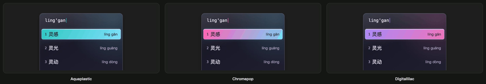

| 主题 | 风格 |
|---|---|
| `Guest-Y2K-AquaPlastic` | Y2K·水色塑料 |
| `Guest-Y2K-ChromePop` | Y2K·铬银流行 |
| `Guest-Y2K-DigitalLilac` | Y2K·数码丁香 |

## 仓库结构

```
.
├── Glow-*.conf                # Glow 系列主题配置（14）
├── Guest-*.conf               # Guest 系列主题配置（71）
├── README.md                  # 本文件
├── README-Glow.md             # Glow 系列完整说明与微调
├── glow-studio/
│   ├── build.py               # 生成 Glow 系列 conf 与 CSS
│   ├── import-guest.py        # 导入 Guest 系列
│   ├── build-guest-previews.cjs  # 渲染 Guest 预览图
│   ├── trim-previews.py       # 裁切压缩预览图
│   ├── palettes.json          # Glow 调色板数据
│   ├── css/                   # 全部 CSS：glow-*.css + guest-*.css
│   ├── preview.html           # 离线交互图册
│   ├── screenshots/           # 预览截图（families/ 为分家族预览）
│   └── tests/                 # 单元测试与浏览器检查
└── fcitx5-custom-theme-collection/   # Guest 系列原始文件
```

## 维护

```sh
# 重新生成 Glow 系列（改 palettes.json / build.py 后）
python3 glow-studio/build.py

# 重新导入 Guest 系列（含 CSS 安装）
python3 glow-studio/import-guest.py --install-css

# 重新生成 Guest 预览图（需 Playwright）
PLAYWRIGHT_MODULE=/path/to/playwright node glow-studio/build-guest-previews.cjs
python3 glow-studio/trim-previews.py

# 校验
python3 -m unittest discover -s glow-studio/tests -v
```

## 微调

- **竖排 / 横排：** 主题编辑器 → 版式 → 布局。Glow 为横排，Guest 为纵排。
- **取消动效、保留发光（仅 Glow）：** macOS 辅助功能 → 显示 → 减少动态效果；或在对应 CSS 末尾加 `#fcitx-theme { --gs-motion: none; }`。
- **字体：** 默认苹方，Glow-Matcha 使用宋体。均有本地后备字体。

## 说明

- Guest 系列为第三方作品，按原样导入，仅重写 `UserCss` 路径与文件头注释；所有其他配置项逐键校验与源文件一致。
- 两个系列的 CSS 变量前缀不同（`--gs-*` / `--dp-*`），可同时安装，不会互相覆盖。

## License

MIT
